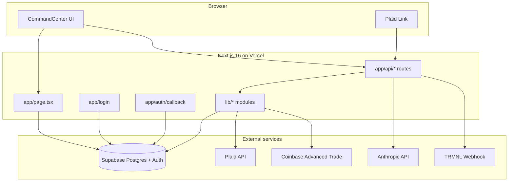
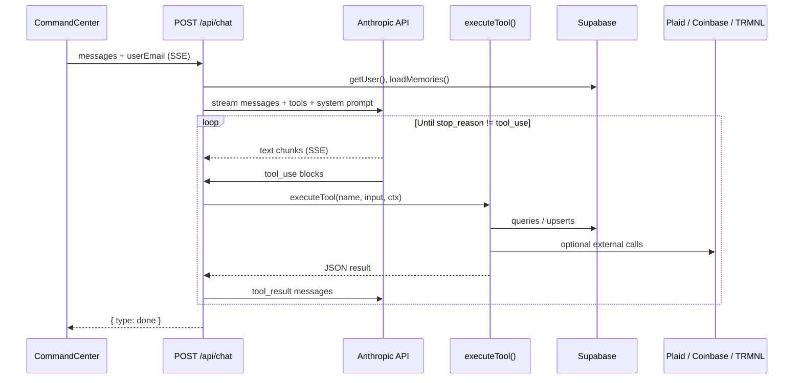

# Architecture

## System diagram



## App Router structure

```
app/
├── layout.tsx              # Root layout, fonts, globals
├── page.tsx                # Auth gate → CommandCenter
├── login/page.tsx          # Google OAuth (client)
├── auth/callback/route.ts  # OAuth code exchange
└── api/
    ├── chat/route.ts                 # Claude SSE + tools
    ├── memories/route.ts             # GET memories
    ├── plaid/
    │   ├── create-link-token/route.ts
    │   ├── exchange-token/route.ts
    │   ├── transactions/route.ts
    │   └── refresh/route.ts
    ├── theo-fund/
    │   ├── summary/route.ts
    │   └── debug/route.ts
    ├── theo-roundup/pending/route.ts
    └── cron/budget-push/route.ts

components/
└── command-center.tsx      # Home, Chat, Budget, Theo Fund tabs

lib/
├── plaid.ts                # Plaid client singleton
├── coinbase-trade.ts       # JWT auth + orders + prices
├── theo-fund.ts            # Round-up calculation + split
├── theo.ts                 # Theo age label
├── upcoming-bills.ts       # Recurring bill detection
├── resolve-name.ts         # Email → display name
└── supabase/
    ├── env.ts
    ├── client.ts           # Browser client
    └── server.ts           # Cookie-based server client
```

## Key lib modules

| Module | Responsibility |
|--------|----------------|
| `lib/plaid.ts` | `PlaidApi` configured from `PLAID_*` env; used by API routes and chat tools |
| `lib/coinbase-trade.ts` | ES256 JWT (Node `crypto`), `getPrices`, `previewMarketBuy`, `placeMarketBuy` |
| `lib/theo-fund.ts` | `calculatePendingRoundups`, `parseSplit`, `computeSplitAmounts`, constants |
| `lib/supabase/server.ts` | `@supabase/ssr` server client with cookie read/write |
| `lib/supabase/client.ts` | Browser client for login OAuth |
| `lib/supabase/env.ts` | `getSupabaseUrl()`, `getSupabaseAnonKey()` with publishable-key fallback |

## API routes catalog

All routes under `app/api/` use **`export const runtime = "nodejs"`** unless noted.

| Method | Path | Auth | Purpose |
|--------|------|------|---------|
| POST | `/api/chat` | Supabase session + email match | Stream Claude responses; execute tools |
| GET | `/api/memories` | Session | Return `{ memories: Record<string,string> }` |
| POST | `/api/plaid/create-link-token` | Session | Create Plaid Link token |
| POST | `/api/plaid/exchange-token` | Session | Exchange public token; upsert `plaid_connections` |
| GET | `/api/plaid/transactions` | Session | Last 90 days transactions + accounts |
| POST | `/api/plaid/refresh` | Session | Plaid `transactionsRefresh` |
| GET | `/api/theo-fund/summary` | Session | Portfolio totals, gain, velocity, failed count |
| GET | `/api/theo-fund/debug` | Session | Diagnostics JSON (env booleans, all purchase rows) |
| GET | `/api/theo-roundup/pending` | Session | Pending round-up total and window |
| GET | `/api/cron/budget-push` | `Bearer CRON_SECRET` | Fetch spend, push budget to TRMNL |

**Related (not under `app/api/`):**

| Method | Path | Purpose |
|--------|------|---------|
| GET | `/auth/callback` | OAuth redirect handler |

## Chat agent tool execution flow



**Tools (10):** `push_reminder`, `clear_reminder`, `get_spending_summary`, `get_spending_history`, `save_memory`, `run_theo_roundup`, `get_crypto_performance`, `retry_failed_crypto_buy`, `buy_crypto`, `set_portfolio_split`.

Implementation: `runAgentLoop()` in `app/api/chat/route.ts` — streams until `stop_reason !== "tool_use"`, runs tools in parallel via `Promise.all`, appends results, loops.

## Auth pattern

There is **no `middleware.ts`**. Auth is enforced per route/page:

1. **`app/page.tsx`** — server component calls `supabase.auth.getUser()`; redirects to `/login` if absent.
2. **API routes** — each calls `createClient()` then `getUser()`; returns 401 if missing.
3. **`POST /api/chat`** — additionally requires `body.userEmail === user.email` (403).
4. **`GET /api/cron/budget-push`** — uses `Authorization: Bearer CRON_SECRET` + Supabase **service role** client (no user session).
5. **OAuth** — `app/login/page.tsx` → Google → `/auth/callback` exchanges code and sets cookies via `@supabase/ssr`.

**Why no middleware:** Prior Edge middleware attempts failed because Plaid and Supabase helpers use Node-only APIs (`__dirname`, etc.). All API routes explicitly set `runtime = "nodejs"`.

## Edge vs Node runtime

| Area | Runtime | Notes |
|------|---------|-------|
| All `app/api/*` routes | **Node.js** | `export const runtime = "nodejs"` |
| `app/page.tsx`, `app/login` | Default (Node for RSC) | Server components use Supabase server client |
| `app/auth/callback` | Default route handler | Uses `@supabase/ssr` cookie bridging |
| Plaid SDK | Node only | Listed in `next.config.ts` → `serverExternalPackages: ["plaid"]` |
| Coinbase JWT | Node `crypto` | `lib/coinbase-trade.ts` uses `sign`, `randomBytes`, `randomUUID` |

Do not move Plaid or Coinbase logic to Edge routes without replacing those dependencies.

## UI tabs (`command-center.tsx`)

| Tab | Data sources |
|-----|----------------|
| **Home** | Plaid transactions, memories, upcoming bills heuristic, quick actions → Chat |
| **Chat** | `POST /api/chat` SSE |
| **Budget** | Plaid Link, `/api/plaid/transactions`, `/api/memories`, refresh |
| **Theo Fund** | `/api/theo-fund/summary`, `/api/theo-roundup/pending`, debug link |

## Cron (Vercel)

`vercel.json`:

```json
{ "crons": [{ "path": "/api/cron/budget-push", "schedule": "0 12 * * *" }] }
```

Daily at 12:00 UTC. Hobby plan allows **one** cron job per project.

## Deployment notes

- Set all env vars in Vercel (Production + Preview as needed); see [ENV.md](./ENV.md) and [.env.example](../.env.example) for variable names.
- `SUPABASE_SERVICE_ROLE_KEY` and `CRON_SECRET` are server-only.
- Google OAuth redirect URLs must include `https://YOUR_DOMAIN/auth/callback` in Supabase Auth settings.
- Plaid requires `PLAID_ENV=production` and production keys for real Chase.
